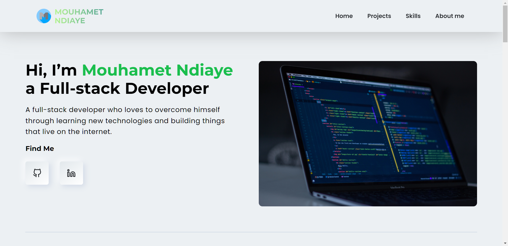
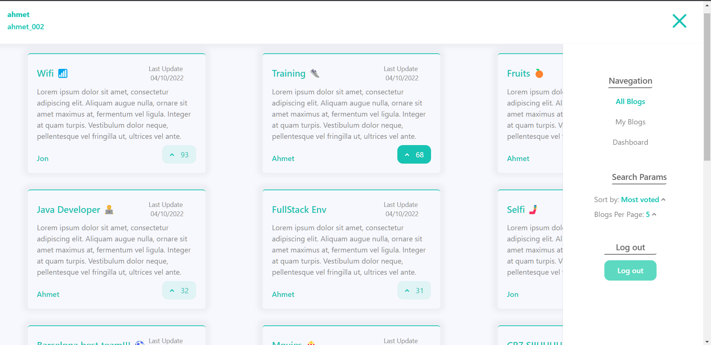
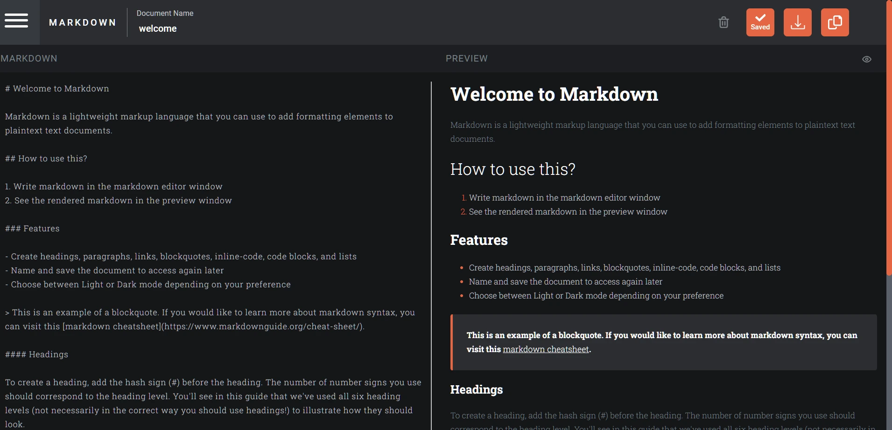
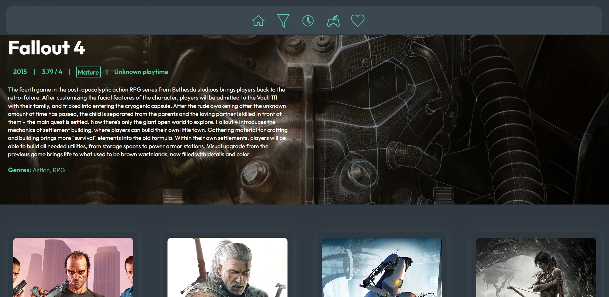

# 🏍️ Mouhamet Ndiaye

**` Full-stack Developer `**

I’m a passionate self-taught full-stack web developer. I love to build things that live on the internet, with a focus on creating scalable and beautiful web applications. On my GitHub profile, you can find some of my projects, each of them has a README file with a description of the project and a live demo. If you want to know more about me, you can check my portfolio with this link [Portfolio](https://mouhametnd.com/) and my LinkedIn profile [LinkedIn](https://www.linkedin.com/in/mouhametnd/).

### 🧰 Languages and Tools

 .

# 

## 🧑‍💻 Latest Projects 

### My Portfolio

### Full-stack blog app

### React In-browser markdown editor

### Angular Full-stack blog app

### React Games app

 

&nbsp;

